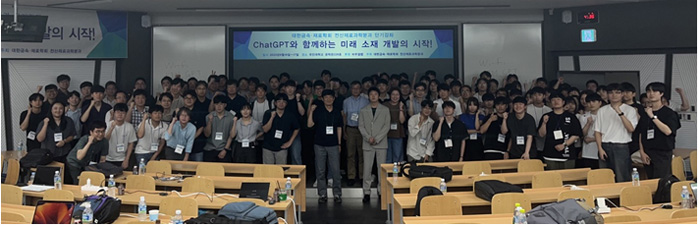
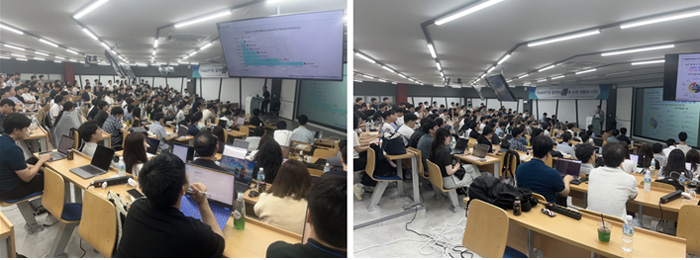

# LLM-tutorials

> 2023 대한금속재료학회 전산재료과학분과 단기강좌  "ChatGPT와 함께하는 미래 소재 개발의 시작!"에서 사용된 수업 자료 입니다.
> 국민대학교 공학관 228호(2층)에서 2023.08.16~17 2일에 걸쳐 진행되었습니다 [출처](https://newsletterkim.or.kr/newsletter/newsletter.php?sub=1&Part=&start=0&No=4464&vol=153&Location=View&PHPSESSID=7ba3ca4224d31ef6b74fb804930d8501)

## Materials

### 1일차: GPT 모델의 이해와 활용

> 자연어처리 소개, 언어모델 방식, Transformer의 등장, BERT와 GPT의 비교에 대한 내용으로 구성되었습니다.

### 2일차: GPT를 이용한 소재문헌 자연어처리

> 소재문헌 자연어처리, Text classification 및 실습, Information extraction에 대한 내용으로 구성되었습니다.
